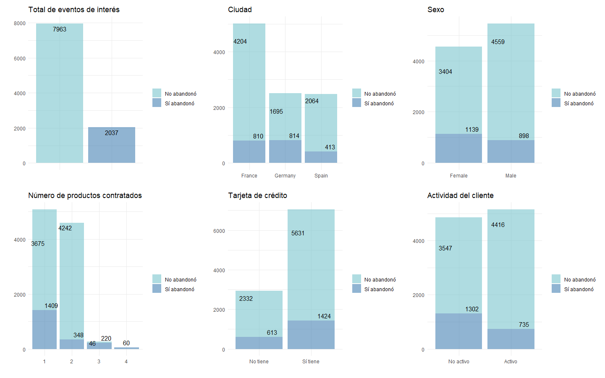
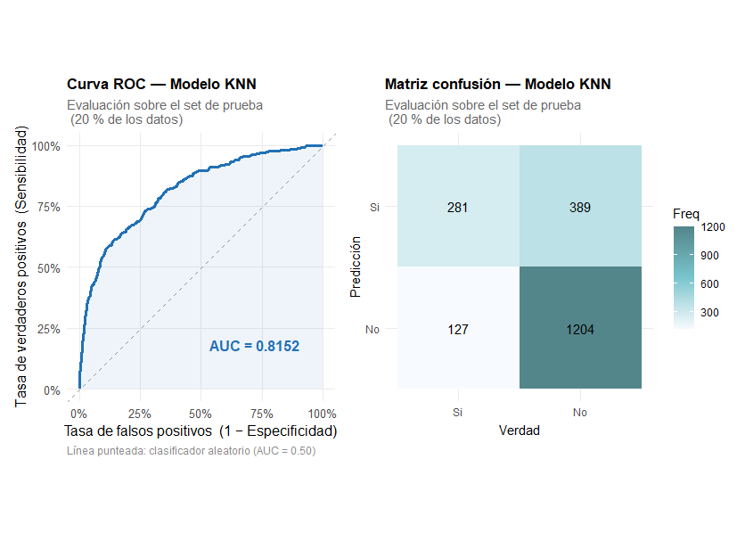
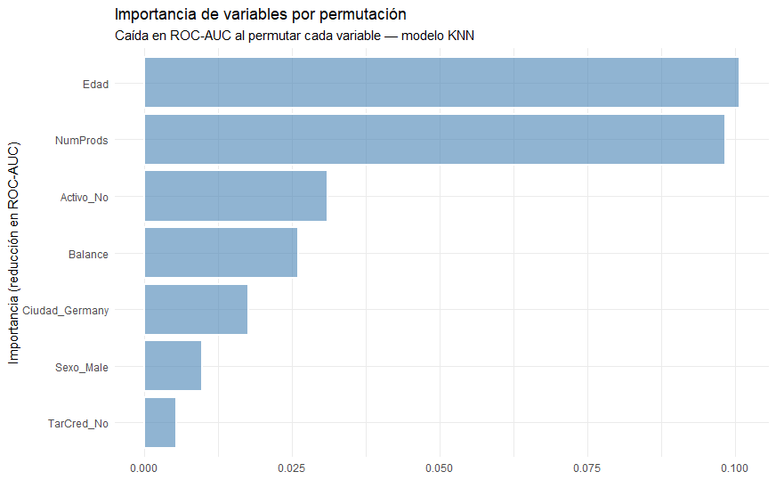
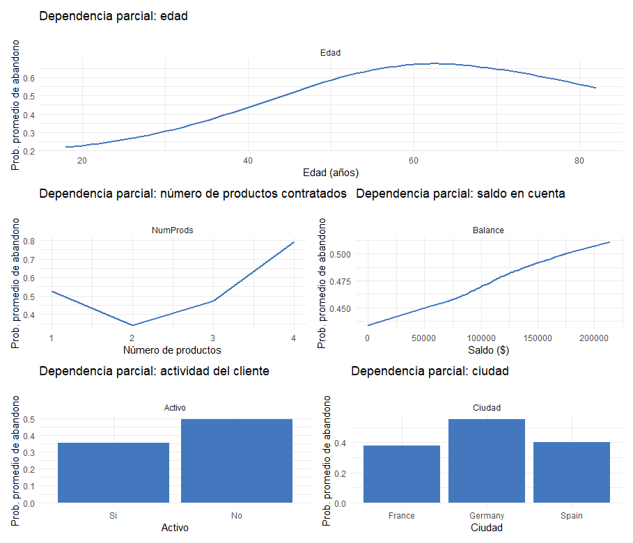

# Churn_Modeling
Predicción de Abandono de Clientes en el Sector Bancario 

## Descripción del problema
El abandono de clientes (churn) representa un desafío estratégico para las instituciones financieras debido a su impacto directo en los ingresos y costos de adquisición. Este proyecto desarrolla un modelo de clasificación supervisada para predecir la probabilidad de abandono y, de forma complementaria, identificar los factores que explican dicho comportamiento.

El enfoque integra técnicas de aprendizaje automático con herramientas de interpretabilidad para generar conocimiento accionable orientado a la retención de clientes.

---

## Objetivos 

- Construir un modelo predictivo capaz de identificar clientes con alta probabilidad de abandono.
- Mitigar el desbalance de clases presente en el dataset.
- Explicar las predicciones a nivel global y local para facilitar la toma de decisiones de negocio.

---

## Desafíos del problema
El dataset presenta un **desbalance significativo de clases** (aproximadamente 80% permanencia vs 20% abandono), lo cual puede sesgar el modelo hacia la clase mayoritaria.

Para abordar este problema, se implementó la técnica:
- **SMOTE (Synthetic Minority Oversampling Technique)**, que genera ejemplos sintéticos de la clase minoritaria, mejorando la capacidad del modelo para detectar eventos poco frecuentes.

---

## Tecnologías utilizadas 
- **Lenguaje:** R  
- **Framework de modelado:** `tidymodels`  
- **Balanceo de clases:** `themis` (SMOTE/SMOTENC)  
- **Interpretabilidad:** `DALEX`, SHAP  
- **Visualización:** `ggplot2` (escalable a visulizadores como PowerBI)  

---

## Análisis Exploratorio de datos (EDA)

### Principales hallazgos:
- Existe un desbalance claro en la variable objetivo.
- La variable **Edad** muestra diferencias que parecen significativas entre clientes que abandonan y los que permanecen.
- Las variables predictoras manifiestan una distrubución normal o uniforme(Antigüedad y Salario Estimado). 
- No existen correlación lienal evidente entre las variables predictoras.

> Nota: Los patrones observados en EDA representan asociaciones, no relaciones causales.

---

## Modelado
Se entrenó un modelo **K-Nearest Neighbors (KNN)** optimizando sus hiperparámetros mediante validación cruzada.

### Resultados

 Métrica         | Valor |
|----------------|------ |
| ROC AUC (train)| 0.82  |
| ROC AUC (test) | 0.81  |
| Precisión      | 0.74  |
| Sensibilidad   | 0.71  |
| Especificidad  | 0.75  |

### Interpretación de métricas
- **ROC AUC ≈ 0.81**: Buena capacidad discriminativa del modelo.
- **Sensibilidad (Recall)**: Indicador clave en churn, ya que refleja la capacidad de detectar clientes que efectivamente abandonan.
- El desempeño es consistente entre entrenamiento y prueba (bajo sobreajuste).

----

## Interpretabilidad del modelo (XAI)

Uno de los aportes principales del proyecto es la incorporación de técnicas de explicabilidad para visulaizar y cuantificar el nivel de impacto de cada variable en la predicción, además permite analizar clientes específicos para comprender a detalle por qué toma la desición de irse o quedarse.

### Importancia global de las variables

Las variables con mayor impacto en la predicción son:
- Edad  
- Número de productos  
- Nivel de actividad  
- Balance  

Esto permite identificar factores críticos asociados al abandono.

> Nota : Un hallazgo importante fue la identificación de Alemania como factor de riesgo de abandono.

### Dependencia parcial (PDP)
Los gráficos de dependencia parcial muestran cómo cambia la predicción promedio del modelo al variar una variable, manteniendo constantes las demás.

Esto revela relaciones:
- No lineales
- Interacciones implícitas del modelo

  

Este análisis  permite detallar la relación compleja entre las variables críticas y la probabailidad de abandono de manera **global**.

---

### Explicaciones Locales (SHAP)

Se utilizó SHAP (Shapley Additive exPlanations) para descomponer predicciones individuales en contribuciones de cada variable, es decir, permite descomponer una predicción compleja hecha por el modelo en contribuciones individuales de las variables involucradas.

Esto permite responder preguntas de negocio como:

> ¿Por qué un cliente específico tiene alta probabilidad de abandono, y cuáles factores influyeron más en la decisión?

  

## Implicaciones de negocio
Los resultados permiten:
- Diseñar campañas de retención focalizadas.
- Identificar perfiles de alto riesgo.
- Priorizar clientes según su probabilidad de abandono.

---

## Trabajo futuro
- Comparación con modelos más robustos (Random Forest, XGBoost)
- Optimización orientada a costos de negocio
- Validación temporal del modelo

---

## Licencia
GPL-3.0
